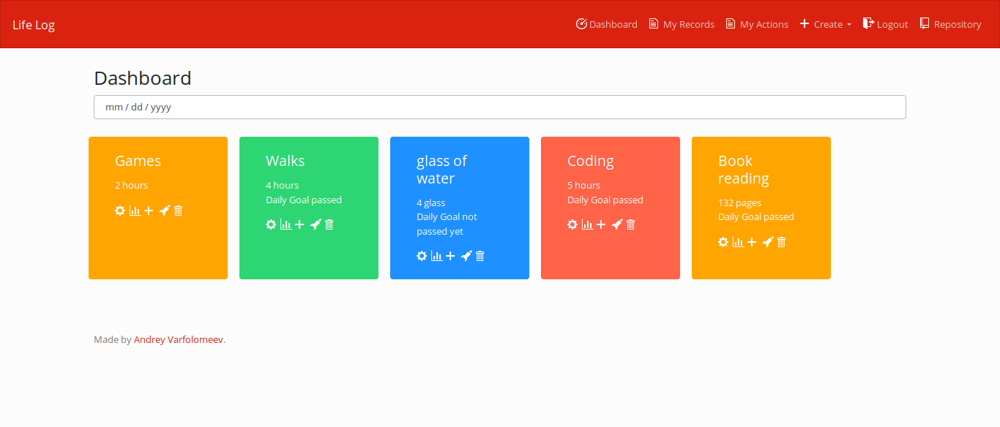

# Life Log

Life log app gives you the opportunity to track your activity.

## Build & Run

Add .env. For developping I'm using this:

    DJANGO_DB_NAME=lifelog
    DJANGO_DB_USER=lifelog
    DJANGO_DB_PASSWORD=lifelog
    DJANGO_DB_HOST=db
    DJANGO_DB_PORT=5432
    DJANGO_SETTINGS_MODULE=config.dev_settings

For build and run, use:

    docker-compose build && docker-compose up

## License

lifelog is free software under terms of the Apache License 2.0

Copyright (C) 2018 by Andrey Varfolomeev
